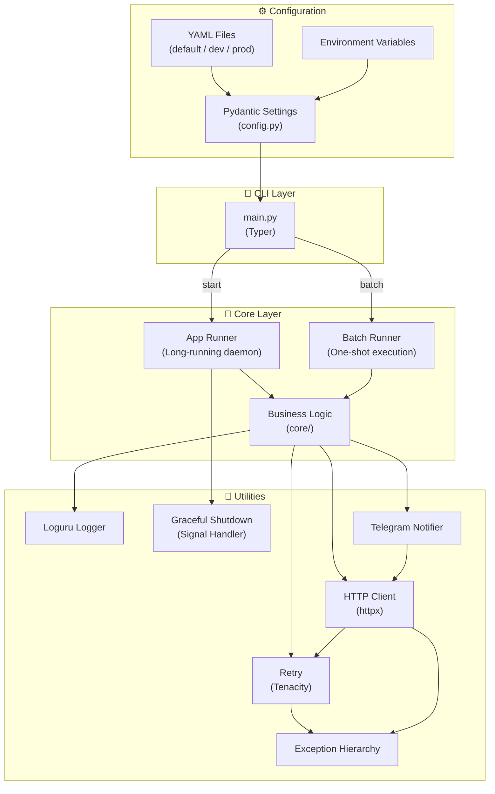
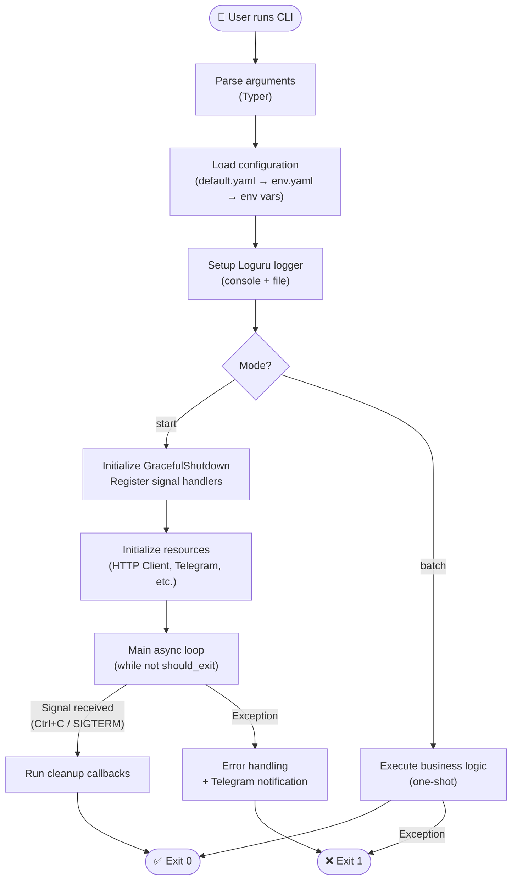

# JPPT - JKLEE Python Project Template

Modern Python CLI application template with best practices built-in.

## Features

- 🎯 **Typer CLI**: Clean command-line interface
- ⚙️ **Pydantic Settings**: Type-safe configuration with layered YAML
- 📝 **Loguru**: Structured logging with date-based rotation (`_YYYYMMDD.log`)
- 🔄 **Tenacity**: Retry logic with exponential backoff
- 📱 **Telegram**: Built-in notifications with interactive setup
- 🌐 **httpx**: Async HTTP client with timeout and error handling
- 🧪 **pytest**: 80% coverage requirement
- 🔍 **mypy**: Strict type checking
- ✨ **ruff**: Fast linting and formatting

## Quick Start

### Creating a New Project

**Linux/macOS:**
```bash
# Create new project from template
./scripts/create_app.sh my-awesome-app

# Or with options
./scripts/create_app.sh my-app --skip-tests  # Skip initial tests
./scripts/create_app.sh my-app --no-hooks    # Skip pre-commit hooks
```

**Windows (PowerShell):**
```powershell
# Create new project from template
.\scripts\create_app.ps1 my-awesome-app

# Or with options
.\scripts\create_app.ps1 my-app -SkipTests   # Skip initial tests
.\scripts\create_app.ps1 my-app -NoHooks     # Skip pre-commit hooks
```

This will:
- ✅ Verify Python 3.11+, uv, and GitHub CLI installation
- ✅ Validate app name (lowercase, numbers, hyphens, underscores only)
- ✅ Create new project directory (`../my-app`)
- ✅ Copy template with proper exclusions
- ✅ Update project name in config files (`default.yaml`, `pyproject.toml`)
- ✅ Create `README.md` and `docs/PRD.md` for new project
- ✅ Initialize git repository with initial commit
- ✅ Create private GitHub repository and push
- ✅ Install all dependencies
- ✅ Set up configuration files (`dev.yaml`)
- ✅ **Interactive Telegram setup** (auto-fetches Chat IDs from API)
- ✅ Install pre-commit hooks (optional)
- ✅ Run initial tests (optional)

### Setting Up JPPT Template Itself

If you want to work on the JPPT template itself (not create a new project):

**Linux/macOS:**
```bash
cd JPPT  # Navigate to JPPT directory
uv sync --all-extras
cp config/dev.yaml.example config/dev.yaml
```

**Windows (PowerShell):**
```powershell
cd JPPT  # Navigate to JPPT directory
uv sync --all-extras
Copy-Item config/dev.yaml.example config/dev.yaml
```

### Run the Application

**Linux/macOS:**
```bash
# Quick run scripts (recommended)
./run.sh              # Start mode, dev environment
./run.sh batch        # Batch mode, dev environment
./run.sh start prod   # Start mode, prod environment
```

**Windows (PowerShell):**
```powershell
# Quick run scripts (recommended)
.\run.ps1              # Start mode, dev environment
.\run.ps1 batch        # Batch mode, dev environment
.\run.ps1 start prod   # Start mode, prod environment
```

**Or use uv directly (all platforms):**
```bash
uv run python -m src.main start --env dev
uv run python -m src.main batch --env dev
```

### Development Commands

```bash
# Run tests
uv run pytest

# Format code
uv run ruff format .

# Type check
uv run mypy src/

# Run all pre-commit checks
uv run pre-commit run --all-files
```

## Architecture

### System Architecture



### Execution Flow



### Configuration Loading

```mermaid
%% TODO(human): Design the configuration loading flow diagram
%% Show the 3-layer cascade: default.yaml → env.yaml → environment variables
%% Include priority order and which files are committed vs gitignored
```

## Project Structure

```
src/
├── main.py              # CLI entry point
├── core/                # Business logic
└── utils/               # Reusable utilities
    ├── config.py        # Settings management (Pydantic)
    ├── logger.py        # Logging setup (Loguru)
    ├── app_runner.py    # App mode (daemon)
    ├── batch_runner.py  # Batch mode (one-shot)
    ├── exceptions.py    # Custom exception hierarchy
    ├── retry.py         # Retry decorator (tenacity)
    ├── signals.py       # Graceful shutdown
    ├── http_client.py   # Async HTTP client (httpx)
    └── telegram.py      # Telegram notifications

scripts/                 # Automation scripts
├── create_app.sh        # Project generator (Linux/macOS)
└── create_app.ps1       # Project generator (Windows)

run.sh                   # Quick run wrapper (Linux/macOS)
run.ps1                  # Quick run wrapper (Windows)

tests/                   # Test suite
config/                  # Configuration files
docs/                    # Documentation
```

## Configuration

### Layered Configuration System

Configuration is loaded in layers, where each layer overrides the previous:

1. **`config/default.yaml`** — Base values and schema (committed to git)
2. **`config/{env}.yaml`** — Environment-specific overrides (gitignored)
3. **Environment variables** — Final overrides for secrets

```yaml
# config/default.yaml
app:
  name: "jppt"
  version: "0.1.0"
  debug: false

logging:
  level: "INFO"
  format: "{time:YYYY-MM-DD HH:mm:ss} | {level: <8} | {name}:{function}:{line} | {message}"
  rotation: "00:00"       # Daily rotation at midnight
  retention: "10 days"    # Keep logs for 10 days

telegram:
  enabled: false
  bot_token: ""
  chat_id: ""
```

### Telegram Setup

Telegram can be configured in two ways:

**1. Interactive setup (recommended):** During `create_app.sh`, the script will:
   - Ask for your Bot Token (get it from [@BotFather](https://t.me/BotFather))
   - Auto-fetch available Chat IDs from the Telegram API
   - Save settings directly to `config/default.yaml`

**2. Environment variable override:**
   ```bash
   # Linux/macOS
   export TELEGRAM_BOT_TOKEN="your-token"
   export TELEGRAM_CHAT_ID="your-chat-id"
   ```
   ```powershell
   # Windows (PowerShell)
   $env:TELEGRAM_BOT_TOKEN="your-token"
   $env:TELEGRAM_CHAT_ID="your-chat-id"
   ```

### Environment-Specific Config

```bash
# Development (auto-created by create_app.sh)
config/dev.yaml

# Production (create manually)
cp config/dev.yaml.example config/prod.yaml
# Edit prod.yaml with production settings
```

## Logging

Logs are written to the `logs/` directory with automatic date-based rotation:

- **Active log:** `logs/{app_name}.log` (or `{app_name}_batch.log` for batch mode)
- **Rotated logs:** `logs/{app_name}_YYYYMMDD.log` (e.g., `myapp_20260206.log`)
- **Rotation:** Daily at midnight (configurable)
- **Retention:** 10 days by default (configurable)

## Scripts

### Project Generator (`scripts/create_app.sh`)

Creates a new project from the JPPT template.

**Linux/macOS:**
```bash
./scripts/create_app.sh <app-name> [OPTIONS]
./scripts/create_app.sh --help    # Show options
```

**Windows (`scripts/create_app.ps1`):**
```powershell
.\scripts\create_app.ps1 <app-name> [OPTIONS]
.\scripts\create_app.ps1 -Help    # Show options
```

**Options:**
| Option | Description |
|--------|-------------|
| `--skip-tests` / `-SkipTests` | Skip running initial tests |
| `--no-hooks` / `-NoHooks` | Skip pre-commit hooks installation |
| `--help` / `-Help` | Show usage information |

**Requirements:**
- Python 3.11+
- [uv](https://docs.astral.sh/uv/) — Package manager
- [GitHub CLI](https://cli.github.com/) — Repository creation (`gh auth login` required)

### Run Scripts

Quick run wrappers — simplified app execution.

**Linux/macOS (`run.sh`):**
```bash
./run.sh [MODE] [ENV]
./run.sh --help           # Show usage

# Examples:
./run.sh                  # start mode, dev env
./run.sh batch            # batch mode, dev env
./run.sh start prod       # start mode, prod env
```

**Windows (`run.ps1`):**
```powershell
.\run.ps1 [MODE] [ENV]
.\run.ps1 -Help           # Show usage

# Examples:
.\run.ps1                 # start mode, dev env
.\run.ps1 batch           # batch mode, dev env
.\run.ps1 start prod      # start mode, prod env
```

## Development

Pre-commit hooks are automatically installed by `./scripts/create_app.sh`.

```bash
# Manually install hooks
uv run pre-commit install

# Run all checks
uv run pre-commit run --all-files
```

## License

MIT
